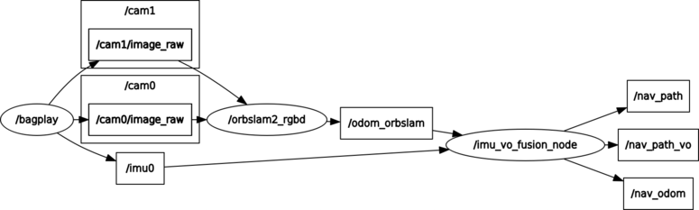
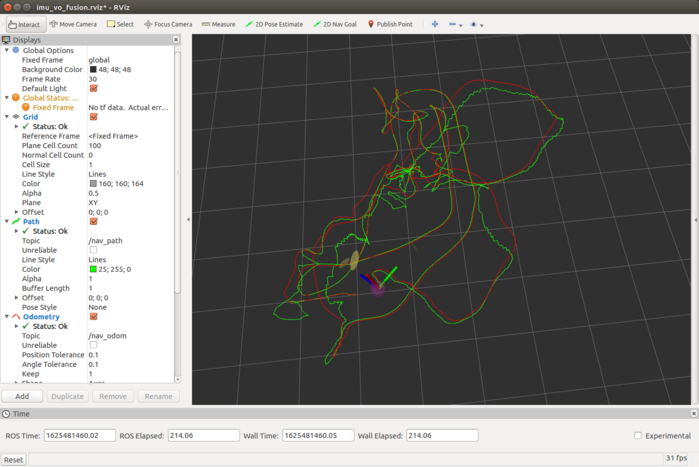

# IMU + X Fusion

IMU + X Loosely-Coupled Fusion Localization

---

## Overview

* IMU + GPS

  - [x] ESKF: [Multi-Sensor Fusion: IMU and GPS loose fusion based on ESKF](https://cgabc.xyz/posts/4e9a780e/)

* IMU + 6DoF Odom (e.g.: Stereo Visual Odometry)

  - [x] ESKF: [IMU and 6 DoF Odometry (Stereo Visual Odometry) Loosely-Coupled Fusion Localization based on ESKF (Presentation)](http://dx.doi.org/10.13140/RG.2.2.28797.69602)

  - [x] IEKF: https://cgabc.xyz/posts/784a80cb/#iekf

  - [x] UKF(including JUKF and SVD-UKF): [IMU and 6 DoF Odometry (Stereo Visual Odometry) Loosely-Coupled Fusion Localization based on UKF](http://dx.doi.org/10.13140/RG.2.2.30602.54727)

  - [x] MAP(User-defined L-M, Ceres-Solver, G2O and GTSAM)


## Features

* Dataset
  - [x] KAIST dataset: ROS publish

* Sensors
  - [x] IMU
    - [x] Numerical Integration (TODO: RK4) 
    - [ ] Pre-Integration
  - [ ] Wheel Odometer
  - [ ] Manometer
  - [x] GPS
  - [x] 6DoF Odom (Stereo Visual Odometry)
  - [ ] LiDAR
  - [ ] Multi-modal data

* State Estimation
  - [x] EKF
    - [x] ESKF
    - [x] IEKF
  - [x] UKF
    - [x] JUKF
    - [x] SVD-UKF
  - [ ] Particle Filter
  - [x] MAP
    - [x] User-defined G-N
    - [x] Ceres-Solver
    - [x] G2O
    - [x] GTSAM

* Local / Global Angular Error (Rotation Perturbation)
  - [x] Local Angular Error (OK)
  - [x] Global Angular Error (TODO: why Poor)
  ```cpp
  enum ANGULAR_ERROR { LOCAL_ANGULAR_ERROR, GLOBAL_ANGULAR_ERROR };
  ```

* Debug
  - [x] Check Measurement Jacobian Matrix


## Requirements

tested on Ubuntu 16.04 and Ubuntu 18.04

* Ubuntu 16.04 & ROS Kinetic

  * OpenCV 3
  * ROS package: nmea_navsat_driver
  * GeographicLib 1.50.1 (built from souce code, cmake 3.18.0 tested)


* Ubuntu 18.04 & ROS Melodic

  * OpenCV 3
  * ROS package: nmea_navsat_driver
  * GeographicLib 1.49
    ```sh
    sudo apt install libgeographic-dev
    ```


## Build

```sh
mkdir -p ws_msf/src
cd ws_msf/src
git clone xxx
cd ..
catkin_make -j4 # error happened when using the default cmake 3.5.1 on Ubuntu 16.04, upgrade it
# or
catkin build -j4
```

## Run on Host

### IMU + GNSS

test data: [utbm_robocar_dataset_20180719_noimage.bag](https://lcas.lincoln.ac.uk/owncloud/index.php/s/KfItDFgwwis5Xrk)

* [sensor_msgs/Imu] /imu/data: 100 hz
* [nmea_msgs/Sentence] /nmea_sentence: 15 hz
* [sensor_msgs/NavSatFix] /fix: 5 hz
* [nav_msgs/Path] /nav_path: 63 hz

```sh
roslaunch imu_x_fusion imu_gnss_fusion.launch
rosbag play -s 25 utbm_robocar_dataset_20180719_noimage.bag
```

ROS graph and path on rviz:

<p align="center">
  
  
</p>

plot the result path (fusion_gps.csv & fusion_state.csv) on Google Map using the scripts `folium_csv.py`:

<p align="center">
  
</p>

### IMU + 6DoF Odom

#### VO: ORB-SLAM2 (Stereo) + EuRoC V1_01_easy.bag

```sh
roslaunch imu_x_fusion imu_vo_fusion.launch [est:=ekf, ukf or map]
```

##### run ORB-SLAM2 (Stereo) and play back bag file

```sh
# https://github.com/cggos/orbslam2_cg
# pose cov:
# sigma_pv: 0.001
# sigma_rp: 0.5
# sigma_yaw: 0.5
roslaunch orbslam2_ros run_stereo_euroc.launch

rosbag play V1_01_easy.bag
```

<p align="center">
  
</p>

results(Green path: estimated pose; Red path: pose of VO):

<p align="center">
  
</p>

##### Use the recorded bag file directly

Download [orbslam2_v101easy.bag](http://gofile.me/5lGth/4XBQVLhAn)

```sh
rosbag play orbslam2_v101easy.bag
```

#### VO: ORB-SLAM2 (Stereo) + MYNTEYE-S1030 Camera

```sh
# TODO: Test
roslaunch imu_x_fusion imu_vo_fusion_mynteye.launch

roslaunch mynt_eye_ros_wrapper mynteye.launch
```

### Run with KAIST Dataset

```sh
rosrun imu_x_fusion kaist_pub /dev_sdb/datasets/KAIST/urban39-pankyo
```


## Run with Docker

```sh
# pull from DockerHub
sudo docker pull cggos/ubuntu-ros-slam:bionic-melodic

# run, e.g.: imu_vo_fusion
./scripts/run_docker.sh

# modify the script for running others
```


## Code Format

code format based on Google style

```sh
./batch_format.sh
```


## Docs

* Requirements
  ```sh
  sudo apt install graphviz
  sudo apt install doxygen
  ```

* Generate
  ```sh
  # output in html and latex dir
  doxygen Doxygen.config
  ```

  
## Community

* Welcom to join [the Discord channel #multi-sensor-fusion](https://discord.gg/2RV2vKmdpa)
