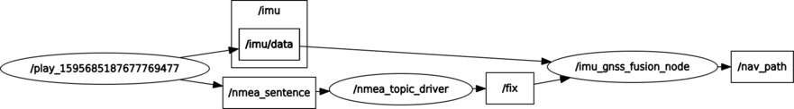
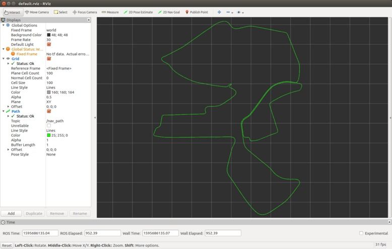
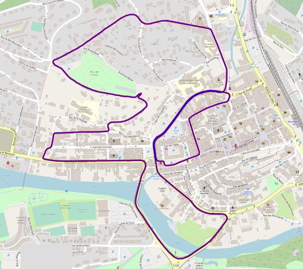

# IMU+GNSS Fusion Localization with ESKF

* [传感器融合：基于ESKF的IMU+GPS数据融合](https://blog.csdn.net/u011178262/article/details/107596285)

-----

## Requirements

* Ubuntu (16.04 or later)
* ROS (kinetic or later)
  - ROS package: **nmea_navsat_driver**
* GeographicLib 1.50.1 (cmake 3.18.0 tested)
* c++14 (for using `std::make_unique`)

## Build

```sh
mkdir -p ws_msf/src
cd ws_msf/src
git clone xxx
cd ..
catkin_make -j5 # error happened when using the default cmake 3.5.1, upgrade it
```

## Run

test data: [utbm_robocar_dataset_20180719_noimage.bag](https://lcas.lincoln.ac.uk/owncloud/index.php/s/KfItDFgwwis5Xrk)

* /imu/data: 100 hz
* /nmea_sentence: 15 hz
* /fix: 5 hz
* /nav_path: 63 hz

```sh
roslaunch imu_gnss_fusion imu_gnss_fusion.launch
rosbag play -s 25 utbm_robocar_dataset_20180719_noimage.bag
```

ROS graph and path on rviz:

<p align="center">
  
  
</p>

plot the result path(fusion_gps.csv & fusion_state.csv) on google map:

<p align="center">
  
</p>
