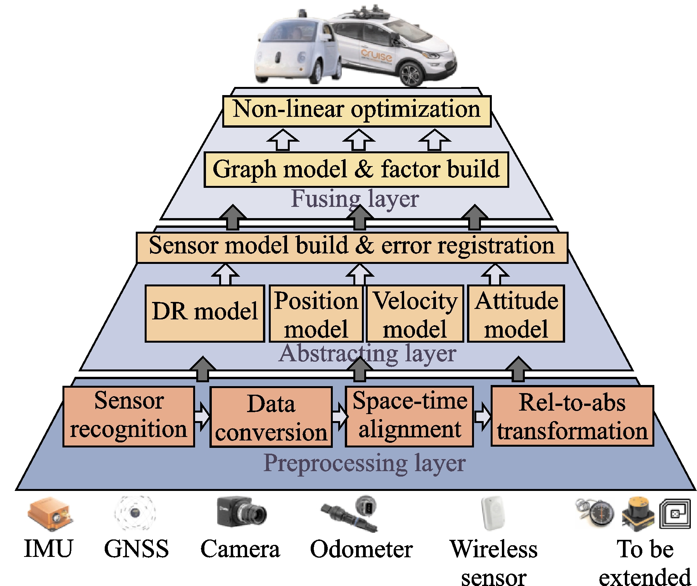

# Multi-Sensor Fusion

---

## Overview

  

* [Sensor Fusion Tutorial](https://datascopeanalytics.com/blog/sensor-fusion-tutorial/)

* [WTF is Sensor Fusion? The good old Kalman filter](https://towardsdatascience.com/wtf-is-sensor-fusion-part-2-the-good-old-kalman-filter-3642f321440)

* [传感器融合：通向自动驾驶时代的关键一步](https://www.leiphone.com/news/201708/HH3MYTdsDx3mFx0S.html)

## Methods

  

* [State Estimation (CGABC)](https://est.cgabc.xyz/)

## Toolbox

* [Sensor Fusion and Tracking Toolbox (mathworks)](https://www.mathworks.com/products/sensor-fusion-and-tracking.html)
